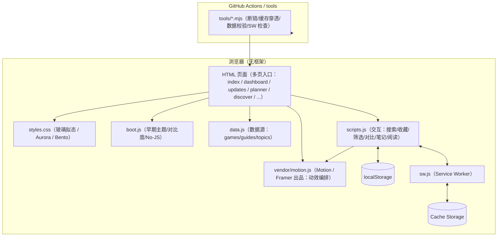

# 游戏攻略网 · GameKnowledge-Base

<p align="center">
  <strong>纯静态 · 无框架 · 数据驱动 · PWA 离线 · 本地状态持久化</strong><br>
  一次维护数据，多页统一渲染。适合 GitHub Pages / 任意静态托管。
</p>

<p align="center">
  <a href="https://github.com/TUR1412/GameKnowledge-Base/actions/workflows/ci.yml">
    
  </a>
  
  
  
  
  
</p>

<p align="center">
  
</p>

<details>
  <summary><strong>动态演示（SVG）</strong>（无需 JS / 可直接在 README 中播放）</summary>
  <br>
  <table>
    <tr>
      <td></td>
      <td></td>
    </tr>
    <tr>
      <td colspan="2"></td>
    </tr>
    <tr>
      <td colspan="2"></td>
    </tr>
    <tr>
      <td colspan="2"></td>
    </tr>
  </table>
</details>

---

## 1) 这是什么？

这是一个 **纯静态** 的游戏知识库/攻略站点：

- **内容由 `data.js` 驱动**：游戏 / 攻略 / 话题统一数据源，动态页按 `id` 渲染
- **全站交互集中在 `scripts.js`**：收藏、筛选、阅读设置、笔记、对比等全部在前端完成
- **离线能力（PWA）**：`sw.js` 缓存核心资源，支持断网浏览模板页与已缓存内容

目标是：**不引框架、不依赖后端，也能做出“产品级”体验**。

---

## 2) 功能速览（核心体验）

- **Command Palette 全站搜索**：`Ctrl + K` / `/` 搜索游戏、攻略、话题 + 快捷操作
- **探索（Discover）**：基于收藏/最近访问/在玩状态做本地个性化推荐 + 一键生成路线
- **路线规划（Planner）**：把游戏/攻略组合成“可执行路线”，支持拖拽排序 + 分享链接导入/导出
- **更新中心（Updates）**：聚合 NEW / UPDATED 内容，一键标记已读，保持信息流干净
- **指挥舱（Dashboard）**：最近访问 / 收藏 / 攻略进度 / 更新概览 + 本地数据备份/迁移
- **本地收藏体系**：游戏/攻略/话题收藏，支持“只看收藏”
- **最近访问**：主页展示最近浏览的游戏/攻略
- **攻略进度清单**：步骤勾选 + 完成度
- **阅读增强**：阅读进度条、专注阅读、字号/行距记忆、继续阅读、复制小节链接
- **跨页 View Transition 形变**：从列表卡片进入详情页时“卡片 → Banner”共享元素转场（支持浏览器启用，自动降级）
- **话题页共享元素转场**：社区话题卡片 → 讨论页 Banner 同样支持形变级转场（更连贯）
- **游戏对比（Compare）**：在“所有游戏”页多选对比，底部对比栏 + 对比弹窗（最多 4 项）
- **更新雷达（NEW / UPDATED）**：为数据条目建立“已读基线”，后续新增/更新自动标记
- **微交互统一动效**：Planner 增删/拖拽反馈、Compare 弹窗/对比栏、收藏星标弹性反馈（可降级）
- **无障碍高对比度模式**：全站可切换更清晰的文本与边界（适合强光环境）
- **离线包一键缓存**：在命令面板中触发缓存图标/封面/深度页资源，提高离线可用性（含进度回执）
- **本地备份/迁移**：导出/导入/清空 `localStorage` 数据（收藏/筛选/回复等）

---

## 3) 架构（可视化）



---

## 4) 页面与数据（动态页约定）

- `game.html?id=xxx` 读取 `data.games[xxx]`
- `guide-detail.html?id=yyy` 读取 `data.guides[yyy]`
- `forum-topic.html?id=zzz` 读取 `data.topics[zzz]`

未收录的 `id` 也会友好兜底，避免断链导致“硬 404”。

---

## 5) 项目结构

```text
.
├─ boot.js                 # 启动脚本：早期主题/高对比度/No-JS 处理
├─ data.js                 # 站点数据：games/guides/topics + version
├─ scripts.js              # 全站交互：搜索/收藏/进度/对比/离线包等
├─ styles.css              # 全站样式：Aurora/Glass/Bento + 组件覆盖策略
├─ sw.js                   # Service Worker：离线缓存 + 更新 + 扩展预缓存
├─ manifest.webmanifest    # PWA 元信息
├─ *.html                  # 多页入口（静态外壳）
├─ images/                 # 图标与占位图（尽量本地，离线更稳）
├─ docs/                   # 规范与部署文档
└─ tools/                  # CI/检查/生成脚本（Node.js）
```

---

## 6) 本地预览

### 6.1 直接打开（最快）

双击打开 `index.html` 即可预览（纯静态）。

说明：部分浏览器对 `file://` 的 `localStorage` / Service Worker 有限制；若需要完整体验（离线/缓存/持久化），建议用静态服务器打开。

### 6.2 使用任意静态服务器（推荐）

你可以使用任意静态服务器（例如 VSCode Live Server、Python `http.server`、Node 任何静态服务等）。

---

## 7) 部署到 GitHub Pages（推荐）

1. 仓库 `Settings` → `Pages`
2. `Build and deployment` → `Source` 选择 `Deploy from a branch`
3. `Branch` 选择 `master`（或默认分支） + `/ (root)`
4. 保存后等待几分钟，GitHub 会生成 Pages 访问地址

完整细节见：`docs/DEPLOYMENT.md`。

---

## 8) 缓存穿透（非常重要）

本项目对核心资源使用 `?v=` 版本号来避免缓存“幽灵更新”：

```html
<link rel="stylesheet" href="styles.css?v=20251222-5">
<script src="boot.js?v=20251222-5"></script>
<script src="data.js?v=20251222-5" defer></script>
<script src="scripts.js?v=20251222-5" defer></script>
```

当你修改 `styles.css` / `scripts.js` / `data.js` / `sw.js` / `manifest.webmanifest` 时，务必同步 bump 版本号。

推荐使用脚本一键升级版本号：

```bash
node tools/bump-version.mjs
```

规范说明：`docs/STYLE_GUIDE.md`

---

## 9) 数据扩展（从这里开始）

核心数据集中在 `data.js`：

```js
version: "20251222-5",

games: {
  "elden-ring": { title: "艾尔登法环", updated: "2025-10-05", ... }
},
guides: {
  "civ6-science": { title: "文明6：科技胜利的终极战略", gameId: "civilization6", ... }
},
topics: {
  "upcoming-games": { title: "2025 年最值得期待的游戏", updated: "2025-12-01", ... }
}
```

字段规范与示例：`docs/DATA_MODEL.md`

---

## 10) 工具与校验（CI 同款）

```bash
# JS 语法检查
node --check boot.js
node --check scripts.js
node --check data.js
node --check sw.js

# 数据模型校验
node tools/validate-data.mjs

# 断链/资源/缓存穿透检查（CI 会跑）
node tools/check-links.mjs

# SW 预缓存策略检查
node tools/check-sw.mjs
```

---

## 11) 安全与稳健性（设计原则）

- **默认可用**：核心内容不依赖 JS 才可见（动效为增强项）
- **CSP + 权限策略**：限制资源来源，减少被注入风险
- **本地数据隔离**：所有状态仅写入浏览器存储，不包含任何密钥
- **离线增强可降级**：PWA 失败不影响基础浏览

---

## 12) 变更记录

详见：`CHANGELOG.md`
