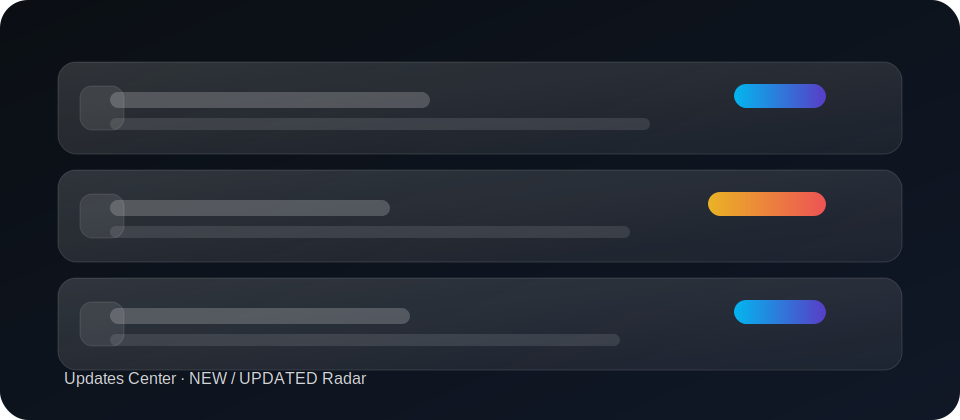

<p align="center">
  
</p>

<h1 align="center">GameKnowledge-Base</h1>

<p align="center"><strong>游戏攻略网 · Data-driven Game Knowledge Base</strong></p>
<p align="center">Static · No framework · Local-first · PWA Offline · View Transitions · Pixel UI (EVO-VIS v4)</p>

<p align="center">
  <a href="https://github.com/TUR1412/GameKnowledge-Base/actions/workflows/ci.yml">
    
  </a>
  <a href="https://github.com/TUR1412/GameKnowledge-Base/actions/workflows/codeql.yml">
    
  </a>
</p>

<p align="center">
  <a href="#概览--overview">概览</a>
  · <a href="#体验亮点--highlights">亮点</a>
  · <a href="#视觉与动效--design--motion">视觉与动效</a>
  · <a href="#快速开始--quick-start">快速开始</a>
  · <a href="#结构--structure">结构</a>
  · <a href="#版本与缓存穿透--versioning">版本与缓存穿透</a>
  · <a href="#contributing--贡献">贡献</a>
</p>

<p align="center">
  
</p>

<p align="center">
  
  
  
</p>

---

## 概览 / Overview

游戏攻略网是一个“数据驱动的纯静态多页站点”，以 `data.js` 作为唯一数据源（SSOT），将内容与交互完全交付在浏览器本地：PWA 离线、收藏/进度/笔记/路线规划、本地诊断与可观测性、跨页转场与微交互体系。

GameKnowledge-Base is a data-driven static multi-page site powered by `data.js` as the single source of truth. It runs fully client-side with local-first state (no backend required): PWA offline, favorites/progress/notes/plans, runtime diagnostics/telemetry, cross-page transitions, and a cohesive micro-interaction system.

---

## 体验亮点 / Highlights

| 模块 | 说明（中文） | Description (EN) |
| --- | --- | --- |
| Command Palette | `Ctrl + K` / `/`：全站搜索 + 快速动作 | Global search + quick actions |
| 本地状态闭环 | 收藏/筛选/笔记/进度/回复均写入 `localStorage` | Local-first state via `localStorage` |
| View Transitions | 跨页共享元素映射 + Root 过渡 | Cross-page shared element transitions |
| 微交互体系 | Hover 抬升/追光、Click Ripple、统一 focus ring | Hover lift/spotlight, click ripple, consistent focus ring |
| Planner | 路线生成、冲刺拆分、可复制计划 | Plan builder, sprint pacing, copyable schedule |
| 运行时诊断 | 错误边界 + 本地埋点 + 健康快照（可导出 bundle） | Error boundary + local telemetry + health snapshot (exportable) |
| 离线体验 | SW 预缓存 + 导航超时回退缓存 + 资源 SWR | Precache + nav fallback + asset SWR |

---

## 视觉与动效 / Design & Motion

### Pixel UI (EVO-VIS v4)

- 视觉：更克制的中性色系统，明确的“hairline border + 精准阴影阶梯”，对标 Apple / Vercel 的信息层级与留白节奏。
- 交互：统一 hover/press/focus 手感；默认 60FPS 友好（优先 transform/opacity）。

### Motion & Micro-interactions

- `scripts.js` 内建 WAAPI 轻量动效层（MotionLite），并统一尊重 `prefers-reduced-motion`。
- 卡片追光（spotlight）：JS 写入 `--fx-x/--fx-y`，CSS 负责渲染（UI 与逻辑解耦、易回归）。
- 点击 Ripple：注入 `span.fx-ripple`，用 CSS keyframes 驱动（无第三方依赖）。

---

## 快速开始 / Quick Start

1. 克隆仓库 / Clone the repo
2. 直接打开 `index.html` 体验站点 / Open `index.html` for local preview
3. 如需校验或构建 / For validation & build:

```bash
npm ci
npm run check:all
npm run build:vite
```

---

## 结构 / Structure

```text
├─ *.html                 # 静态入口页（多页）
├─ data.js                # 唯一数据源（window.GKB.data）
├─ scripts.js             # 运行时交互（无框架）
├─ styles.css             # 视觉系统（Aurora Glass + Bento + Pixel UI）
├─ sw.js                  # Service Worker（离线缓存）
├─ manifest.webmanifest   # PWA 配置
├─ docs/                  # 文档中心（docs.html 动态加载）
└─ tools/                 # 校验 / 生成脚本（CI 门禁）
```

---

## 版本与缓存穿透 / Versioning

项目以“静态站点稳定交付”为目标：修改 `styles.css / scripts.js / data.js / sw.js / manifest` 等核心资源时，必须同步更新所有 HTML 的 `?v=`，以确保离线缓存与浏览器缓存一致刷新。

This project uses cache-busting query params (`?v=`) as a release contract. When core assets change, update the version across all HTML pages to avoid stale caches (especially for PWA offline).

推荐做法 / Recommended:

```bash
node tools/bump-version.mjs
```

---

## Contributing / 贡献

请查看：

- `docs/CONTRIBUTING.md`
- `docs/STYLE_GUIDE.md`
- `docs/DATA_MODEL.md`
- `docs/DEPLOYMENT.md`

See the same docs above for workflow, design/motion rules, data model constraints, and deployment notes.

