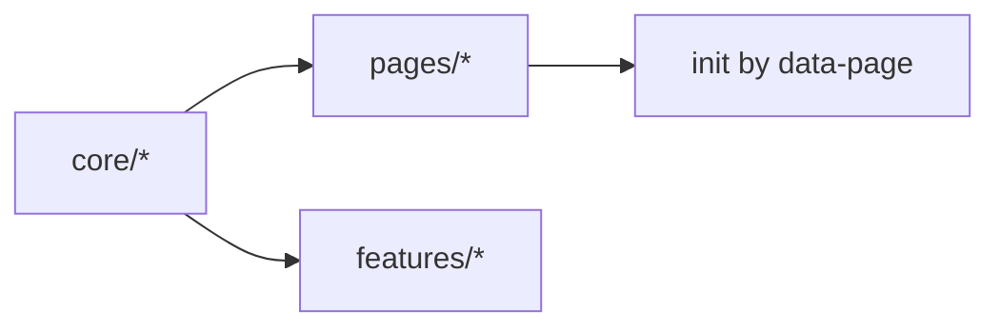

# 变更提案: GKB 2026 全方位升级（内容引擎 × 运行时内核 × 稳定交付）

## 元信息

```yaml
类型: 重构/优化/新功能（路线图）
方案类型: implementation
优先级: P0
状态: 草稿
创建: 2026-01-27
范围: 全站（内容/体验/性能/工程化/发布/协作）
```

---

## 1. 需求

### 背景（我为什么要做这次升级）

我把 GKB 当作“一个可以长期成长的产品”，而不是一堆页面与脚本的集合。

现状已经很强（纯静态、本地优先、PWA 离线、View Transitions、工具链门禁齐全），但当我把目标从“能用且很酷”提升到“能持续扩张、可长期维护、可被协作者持续贡献”时，瓶颈会集中在 4 个地方：

1) **内容规模增长的摩擦**  
现在内容主要集中在 `data.js`，它是运行时 SSOT，但不适合作为“协作写作的源格式”（merge 冲突、字段一致性、批量编辑、素材组织与审核流程都不够顺手）。

2) **运行时复杂度增长的摩擦**  
`scripts.js` 已经承载了大量能力（设置中心、命令面板、planner、诊断/埋点、离线包、跨页转场等）。继续叠功能会让它更难拆分、更难回归，也会增加首屏解析/执行成本。

3) **发布与缓存穿透的心智负担**  
我已经有 `?v=` + bump 脚本，但当资源变多（分 chunk、离线包分层、更多入口页）时，仅靠人工记忆会成为“幽灵缓存”的温床。需要把“稳定交付”从约定升级为系统化流程。

4) **可增长性（SEO / 可发现性 / 可分享性）**  
目前已经有 sitemap/feed/opensearch 等基础设施，但我希望把“内容增长”当作第一等级目标：更清晰的信息架构、更强的结构化数据、更可控的分享卡片与外部引用。

### 目标（我最终想得到什么）

我这次要的不是“补丁式优化”，而是一次可落地的系统升级：**把 GKB 变成一个“内容引擎 + 本地优先体验平台”的长期架构**。

我希望交付的结果可以用 9 个关键词概括：

1) **可持续扩张**：内容规模从几十条扩到数千条时，编辑/校验/发布仍然顺滑
2) **低维护成本**：功能继续增长但不会把 `scripts.js` 变成不可维护巨石
3) **性能可预算**：明确性能预算（体积/解析/长任务），并用门禁把回退扼杀在 PR 阶段
4) **离线可控**：离线包可分层、可进度、可回滚，更新策略清晰，避免“旧 SW + 新页面”错配
5) **搜索更像产品**：不仅能搜到，还能“懂我在找什么”（联想、同义词、筛选、最近/收藏加权）
6) **SEO 体系化**：结构化数据 + 可发现性（feed/sitemap/OG/分享）一体化
7) **状态可携带**：本地数据可一键导出/导入，支持多设备迁移（不引入后端）
8) **协作友好**：贡献者可以在不理解全部代码的情况下添加内容/修订文案，并被工具链守护
9) **安全不妥协**：严格 CSP、零运行时外链、对本地状态与诊断数据有明确隐私边界

### 约束条件（我明确要坚持的底线）

```yaml
站点形态: 纯静态（GitHub Pages 级别即可部署）
运行时依赖: 不引入第三方运行时依赖（不出现在最终产物里）
后端: 不引入后端服务（包括“为了某个功能临时上个 API”这种）
安全: 继续保持严格 CSP，禁止外链脚本/样式/图片等可渲染资源
离线: PWA 能力必须保留且更可控（离线兜底/预缓存策略不倒退）
体验: 继续尊重 reduced motion / high contrast / reduced transparency
```

### 验收标准（我如何判定这次升级“真的完成”）

- [ ] 内容工程：引入可协作的“内容源格式”（`content/`），并可一键生成运行时 `data.js`（字段稳定排序、可重复构建）
- [ ] 内容校验：内容源与生成产物都可被 `npm run check:all` 验证，新增/修改内容时错误可定位到具体条目与字段
- [ ] 运行时模块化：`scripts.js` 能被拆分为可测试的模块（core/page/features），页面只加载必要入口
- [ ] 性能预算：CI 引入明确预算（gzip 体积、关键路径执行耗时/长任务），并可持续执行（不依赖手工）
- [ ] 搜索升级：Command Palette 支持更强的检索（同义词/拼写容错/权重），并通过 Worker + 持久化索引避免首开卡顿
- [ ] 离线可控：离线包与 SW 更新流程具备“进度回执 + 版本一致性校验 + 明确的更新提示/回滚策略”
- [ ] SEO & 分享：关键页面具备 JSON-LD/OG/Canonical（可按规则批量生成，避免手填）
- [ ] 状态可携带：本地状态支持一键导出/导入，并具备版本迁移策略与隐私说明（默认不包含任何密钥/令牌）
- [ ] 贡献者体验：新贡献者从 0 到“新增一个游戏 + 一条攻略 + 一条话题”时间 ≤ 10 分钟（含本地校验）
- [ ] 文档同步：新增内容工程/运行时内核/离线策略/发布流程的模块文档，并与代码事实一致

---

## 2. 方案

### 总体方案（唯一方案：分轨并行 + 分阶段落地）

我不做“列一堆可选项”的保守路线。升级采用**一条主线**：用工程化手段把内容与运行时解耦，把交付流程变成系统能力。

升级分为 6 条并行轨道，按阶段推进：

1) **内容引擎（Content Engine）**：把“可编辑源”从 `data.js` 解耦出来，形成可协作的内容源与生成器  
2) **运行时内核（Runtime Kernel）**：把 `scripts.js` 从巨石拆成可组合模块，降低耦合与回归成本  
3) **搜索与信息架构（Search & IA）**：把搜索升级为产品能力，并形成稳定的分类/标签体系  
4) **离线与更新（Offline & Updates）**：让离线包与更新流程可控、可回滚、可观察  
5) **性能与质量（Perf & Quality）**：建立预算、门禁与基线，持续压制回退  
6) **增长与协作（SEO & Community）**：让内容更可发现、贡献更简单、协作更一致

### 阶段划分（建议 4 个 Sprint，快速落地）

```yaml
Sprint 0 (2-3 天): 基线与审计
Sprint 1 (1 周): 内容引擎 v1（content -> data.js）
Sprint 2 (1-2 周): 运行时内核 v1（模块化 + 构建/交付）
Sprint 3 (1 周): 搜索/离线/SEO 打通 + 发布自动化
```

> 说明：时间只是节奏建议，真正的进度由门禁与验收驱动（过门禁才算完成）。

### 关键交付物（按轨道）

| 轨道 | 交付物（我最终要拿到的东西） |
|---|---|
| 内容引擎 | `content/` 源文件 + `tools/build-data.mjs` 生成 `data.js` + 可定位的校验报错 |
| 运行时内核 | `src/runtime/**` 模块化代码 + 可构建产物 + 页面级入口加载策略 |
| 搜索 & IA | Worker 化索引/查询 + 标签体系约束 + Command Palette 升级 |
| 离线与更新 | 分层离线包 + 进度回执 + 更新提示/回滚策略 + SW 一致性校验 |
| 性能与质量 | 性能预算脚本 + CI 门禁 + 基线报告（可对比） |
| SEO & 协作 | JSON-LD/OG/Canonical 批量生成 + 贡献者工作流文档 + issue/PR 规则强化 |

### 影响范围（我预期会动到哪里）

```yaml
内容:
  - data.js: 逐步从“手写 SSOT”转为“生成产物（runtime SSOT）”
  - content/*: 新增协作源格式（games/guides/topics）
运行时:
  - scripts.js: 拆分迁移到 src/runtime（保留兼容层）
  - boot.js: 首帧策略与版本一致性联动（必要时）
  - styles.css: 组件消费新模块与新入口（必要时）
离线:
  - sw.js: 预缓存清单与更新策略升级
  - offline.html / manifest.webmanifest: 与离线包与更新 UX 对齐
站点入口:
  - *.html: 资源引用、SEO/分享元信息、可访问性约束的批量升级
工具链:
  - tools/*: 新增 build-data/release/perf-budget 等脚本
  - tests/*: 为新增工具与核心模块补齐单测
CI/发布:
  - .github/workflows/*: 门禁与发布链路对齐
文档:
  - docs/*: 内容工作流、发布流程、约束文档（以代码为准）
  - helloagents/*: 路线图、模块文档、变更记录（SSOT）
```

### 风险评估（我先把坑写在纸面上）

| 风险 | 等级 | 影响 | 应对 |
|------|------|------|------|
| 内容源迁移导致数据错配 | 高 | 页面渲染错误、断链、排序/筛选异常 | 增量迁移（双写期）、生成器严格校验、CI 门禁先于发布 |
| 构建产物引入导致缓存错配 | 高 | 幽灵缓存、离线失败、旧 SW/新页面错配 | 版本一致性门禁、SW 预缓存清单自动生成、更新提示/回滚策略 |
| `scripts.js` 拆分导致功能回归 | 中 | 交互异常、局部模块失效 | 按 feature 迁移、关键路径回归 checklist、为 core/features 补齐单测 |
| 搜索 Worker 化导致兼容问题 | 中 | 低端环境不可用/性能下降 | 运行时检测后启用、提供降级路径（轻量主线程查询/禁用持久化） |
| SEO/分享元信息批量生成出错 | 低 | 分享卡片异常、索引偏差 | `tools/check-html.mjs` 门禁 + 本地预览/快照校验 |

---

## 3. 技术设计（升级的“骨架”）

### 3.1 内容引擎：源格式 → 生成产物

我采用“源格式可写、产物可跑”的模式：

- **作者写**：`content/`（更适合协作与审核）
- **站点跑**：`data.js`（保持运行时 SSOT 与零依赖加载）

```mermaid
flowchart TD
  A[content/* (YAML/MD)] -->|tools/build-data.mjs| B[data.js (runtime SSOT)]
  B --> C[scripts.js / runtime]
  B --> D[feed.xml / sitemap.xml (可复用生成器)]
  B --> E[docs 页面索引/标签统计（可选）]
```

关键原则：

- 生成器输出保持稳定排序（减少 merge 冲突）
- 生成器对字段缺失/非法值给出“可定位”错误（到文件与 key）
- `data.js.version` 与 `?v=` 统一由 release 流程驱动，减少手改

### 3.2 运行时内核：拆分策略（不牺牲“无框架”）

目标不是引入框架，而是让代码具备“可组合性”：



建议模块边界（示例）：

- `core/`：dom/storage/events/motion/net/telemetry/diagnostics/router
- `features/`：command-palette/planner/offline-pack/settings/virtual-list/view-transition
- `pages/`：index/all-games/all-guides/game/guide-detail/community/forum-topic/dashboard/updates/discover

拆分后的收益：

- 更容易写单元测试（尤其是工具函数与纯逻辑模块）
- 更容易按页面做按需加载（减少无意义初始化与首屏成本）
- 更容易在不破坏全局的情况下迭代某个 feature

### 3.3 构建与交付：把“极限压缩”升级为“默认交付路径”

目前 Vite 是可选极限压缩。我这次升级要把它升级为**发布路径的一部分**：

- 本地仍可直接打开 HTML（保留“零门槛预览”）
- 发布时产物以 `dist/` 为主（更小、更快、更可控）
- 交付契约由工具链保证：`check-all + build + version + sw` 形成闭环

---

## 4. 核心场景（升级后我希望怎么用）

### 场景 A：我想新增一个游戏条目（协作可持续）

1) 在 `content/games/<id>.yaml` 写入条目（或通过 CLI 创建）  
2) 执行 `node tools/build-data.mjs` 生成 `data.js`  
3) 执行 `npm run check:all` 验证（图标存在、字段合法、断链为 0）  
4) 提交 PR（CI 必须绿）

**结果**：内容贡献变成“写内容 + 过门禁”，不要求贡献者理解全部前端逻辑。

### 场景 B：我要发布一个新版本（幽灵缓存被系统消灭）

1) 执行 release 命令（自动 bump version + 生成产物 + 校验）  
2) CI 通过后部署到 Pages  
3) 用户侧收到“新版本可用”的更新提示，可控刷新

**结果**：版本一致性由流程保证，而不是靠人记忆。

---

## 5. 技术决策（我在这次升级里强制落锤的点）

### GKB-2026#D001：内容源引入 `content/`，`data.js` 变为生成产物

**日期**：2026-01-27  
**状态**：✅采纳  
**决策**：写作协作以 `content/` 为中心；站点运行仍以 `data.js` 为 SSOT（但它由生成器产出）  
**理由**：这是“规模化内容增长”与“稳定交付”的分水岭；没有它，全方位升级只会让维护成本指数上升。

### GKB-2026#D002：Vite 构建从“可选”升级为“发布链路的一部分”

**日期**：2026-01-27  
**状态**：✅采纳  
**决策**：发布链路必须包含 `npm run build:vite`，并把构建产物纳入预算与 SW 预缓存策略  
**理由**：我需要一个可预算的交付形态（体积/性能/缓存行为可控），而不是把压力留给运行时与用户浏览器。

### GKB-2026#D003：搜索索引迁移到 Worker + 持久化（避免首开卡顿）

**日期**：2026-01-27  
**状态**：✅采纳  
**决策**：索引构建与重计算放到 Worker，结果持久化（IndexedDB 或 localStorage 的压缩 blob）  
**理由**：搜索是核心入口；它不能用“加载时做一堆同步计算”去换功能。
