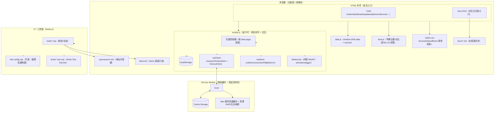

# 架构设计

## 总体架构

---

## 技术栈

- **前端:** 原生 HTML / CSS / JavaScript（无框架）
- **离线:** Service Worker + Cache Storage + PWA Manifest
- **工具链:** Node.js + GitHub Actions（断链 / SW / 数据模型 / Feed / Sitemap 校验）

---

## 核心流程

### 页面启动（首屏一致性）

1. `boot.js` 在最早期执行：恢复主题/高对比度/No-JS 标记
2. `data.js` 注入 `window.GKB.data`
3. `scripts.js` 在 `DOMContentLoaded` 后按 `data-page` 精确调度页面逻辑：
   - 全局交互（主题/导航/Command Palette/PWA/Toast 等）
   - 网络状态闭环：`netStore` 维护 online/connection/inflight，Toast 等订阅统一状态来源
   - 高延迟优化：内部链接 hover/focus 预取（prefetch），减少跨页等待
   - 长列表可扩展：攻略库/话题库在超大数据量下自动启用虚拟列表（仅渲染可视区）
   - 工程自诊断：控制台 `GKB.health()` 输出“系统健康全景图”，可开启实时采样
   - 页面级逻辑（all-games / all-guides / game / guide / updates / planner / discover / community / forum）
   - 文档入口：`docs.html` 同源加载并渲染 `docs/*.md`
4. `sw.js` 空闲时注册；
   - 导航：短窗口等待网络，否则回退缓存并后台刷新（避免“高延迟白屏”）
   - 资源：SWR（缓存优先 + 后台刷新）
   - 离线：导航回退 `offline.html`

### 离线包缓存（用户主动触发）

1. 页面向 SW 发送消息：`{ type: "GKB_PRECACHE", requestId, urls }`
2. SW 逐项请求并写入 Cache Storage
3. SW 回传进度：`GKB_PRECACHE_PROGRESS` / `GKB_PRECACHE_DONE`

---

## 重大架构决策

| adr_id | title | date | status | affected_modules | details |
|--------|-------|------|--------|------------------|---------|
| ADR-20251224-01 | 动效层内建：移除额外脚本请求，统一 MotionLite | 2025-12-24 | ✅已采纳 | runtime | `scripts.js` 内建 MotionLite（WAAPI） |
| ADR-20251224-02 | 高延迟体验闭环：netStore/netClient + SWR 缓存策略 + 文档入口 | 2025-12-24 | ✅已采纳 | runtime | `scripts.js` 增加网络状态闭环与预取；`sw.js` 导航超时回退 + 资源 SWR；新增 `docs.html` |
| ADR-20251224-03 | 长列表虚拟化与自诊断：Virtual List + Console Health | 2025-12-24 | ✅已采纳 | runtime | `scripts.js` 内建虚拟列表引擎（10w 级可用）与 `GKB.health()` 诊断输出 |
