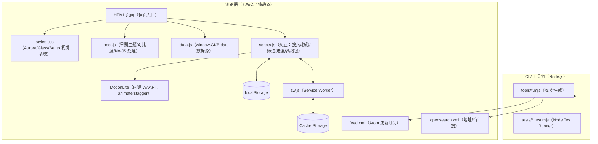

# 架构设计

## 总体架构

---

## 技术栈

- **前端:** 原生 HTML / CSS / JavaScript（无框架）
- **离线:** Service Worker + Cache Storage + PWA Manifest
- **工具链:** Node.js + GitHub Actions（断链 / SW / 数据模型 / Feed / Sitemap 校验）

---

## 核心流程

### 页面启动（首屏一致性）

1. `boot.js` 在最早期执行：恢复主题/高对比度/No-JS 标记
2. `data.js` 注入 `window.GKB.data`
3. `scripts.js` 在 `DOMContentLoaded` 后按 `data-page` 精确调度页面逻辑：
   - 全局交互（主题/导航/Command Palette/PWA/Toast 等）
   - 页面级逻辑（all-games / all-guides / game / guide / updates / planner / discover / community / forum）
4. `sw.js` 空闲时注册；离线时导航回退 `offline.html`

### 离线包缓存（用户主动触发）

1. 页面向 SW 发送消息：`{ type: "GKB_PRECACHE", requestId, urls }`
2. SW 逐项请求并写入 Cache Storage
3. SW 回传进度：`GKB_PRECACHE_PROGRESS` / `GKB_PRECACHE_DONE`

---

## 重大架构决策

| adr_id | title | date | status | affected_modules | details |
|--------|-------|------|--------|------------------|---------|
| ADR-20251224-01 | 动效层内建：移除额外脚本请求，统一 MotionLite | 2025-12-24 | ✅已采纳 | runtime | `scripts.js` 内建 MotionLite（WAAPI） |
